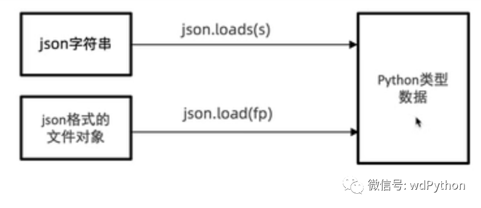

JSON（JavaScript Object Notation, JS对象简谱）是一种轻量级的数据交换格式。  
它基于 ECMAScript（European Computer Manufacturers Association, 欧洲计算机协会制定的js规范）的一个子集，采用完全独立于编程语言的文本格式来存储和表示数据。  
简洁和清晰的层次结构使得 JSON 成为理想的数据交换语言。易于人阅读和编写，同时也易于机器解析和生成，并有效地提升网络传输效率。

---

## JSON语法规则

- 名称必须用双引号（即：" "）来包括
- 值可以是双引号包括的字符串、数字、true、false、null、JavaScript数组，或子对象
- 数据在 name/value 中
- 数据键用逗号分隔
- 大括号 `{}` 保存对象
- 方括号 `[]` 保存数组

---

## Python 中可以使用 json 模块来对 JSON 数据进行编解码

它包含了两个函数：

- `json.dumps()`：对数据进行编码
- `json.loads()`：对数据

